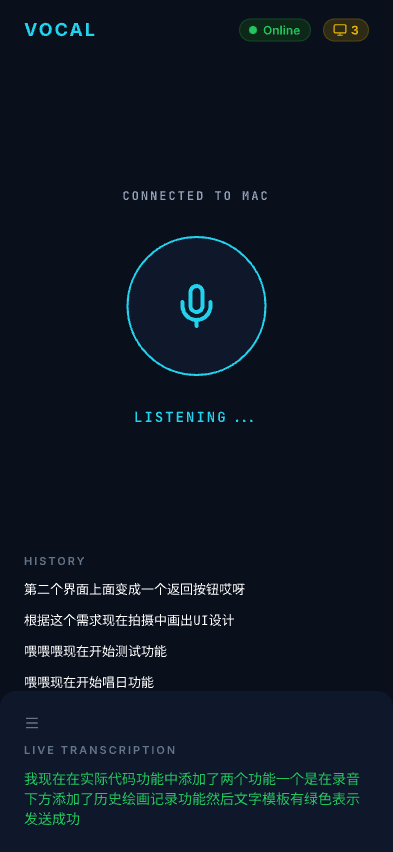
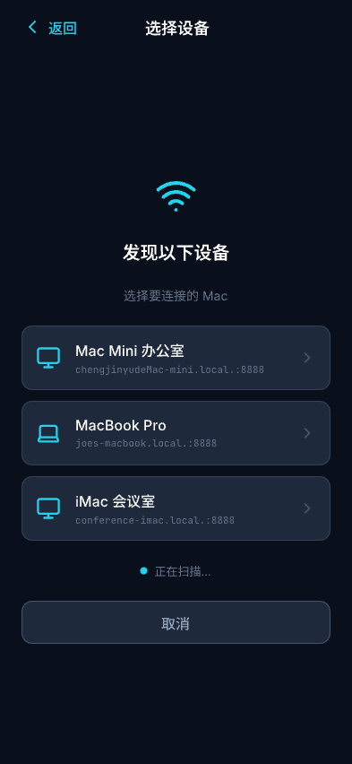
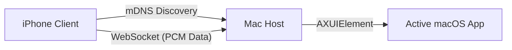

# Vocal 🎙️

**High-speed, low-latency voice keyboard for your Mac, powered by your iPhone.**

English | [中文版](README_zh.md)

Vocal turns your iPhone into a professional-grade remote voice input device. It uses native Apple Speech Recognition to stream low-latency transcriptions directly to your Mac, injecting text into any focused application as if you were typing on a keyboard.

---

## ✨ Features

- **🚀 Near-Zero Latency**: Real-time WebSocket streaming ensures minimal delay between speaking and typing.
- **📱 Native STT**: Leverages Apple's native `SFSpeechRecognizer` for high accuracy and multi-language support.
- **🔍 Seamless Discovery**: Automatic Mac discovery via mDNS (Bonjour/ZeroConf) - no IP addresses needed.
- **⌨️ Universal Input**: Injects text via Accessibility APIs, working across all macOS applications.
- **🎨 Minimalist Aesthetic**: A sleek "Terminal x Minimal" UI with dark mode and live feedback.

## 📸 Screenshots

| iPhone Client | Mac Host Proxy |
| :---: | :---: |
|  |  |

---

## 🛠️ Tech Stack

- **Mac Host**: Swift, `Network.framework` (WebSocket), `mDNS` (NetService), `Accessibility APIs`.
- **iOS Client**: Flutter, `SpeechToText` (SFSpeechRecognizer), `mDNS` discovery.
- **Protocol**: Custom WebSocket streaming over TCP with automatic service discovery.

---

## 🚀 Getting Started

### 1. Mac Host Setup

The host application runs in your menu bar and acts as the receiver.

**Build and Launch:**
```bash
# From the project root
swiftc -o VocalHost mac/VocalHostApp.swift -parse-as-library
./VocalHost &
```

**Permissions:**
- Click the **Vocal icon** in your menu bar.
- Ensure **Accessibility** permissions are granted (`System Settings > Privacy & Security > Accessibility`).

### 2. iPhone Client Setup

The client handles the voice recognition and transmission.

**Run:**
```bash
cd mobile
flutter run
```

**Requirements:**
- Both devices must be on the **same Wi-Fi network**.
- Grant **Microphone** and **Speech Recognition** permissions on the iPhone.

---

## 🏗️ Architecture



## 📋 Roadmap
- [ ] mDNS Device Selection List (In Progress)
- [ ] Support for multiple languages
- [ ] Push-to-Talk via Mac keyboard shortcut

## 📄 License
MIT License - Copyright (c) 2026 Vocal Contributors
