# Vocal 🎙️

**基于 iPhone 的 Mac 高速、低延迟语音录入键盘。**

[English](README.md) | 中文版

Vocal 将您的 iPhone 转换为专业的远程语音输入设备。它利用苹果原生的语音识别技术（Speech Recognition），通过低延迟的 WebSocket 流将识别结果直接传输到您的 Mac，并像键盘输入一样将文本注入到任何当前选中的应用程序中。

---

## ✨ 核心特性

- **🚀 极低延迟**：实时 WebSocket 流传输，确保语音转文字几乎同步完成。
- **📱 原生识别**：调用 Apple 原生 `SFSpeechRecognizer` 引擎，支持高精度识别及多语言切换。
- **🔍 自动发现**：通过 mDNS (Bonjour/ZeroConf) 自动发现局域网内的 Mac 电脑，无需手动输入 IP 地址。
- **⌨️ 全局输入**：利用 macOS Accessibility (辅助功能) API，支持在所有 macOS 应用程序中输入文本。
- **🎨 极简美学**：采用 “Terminal x Minimal” 设计风格，支持深色模式并提供实时转录反馈。

## 📸 界面截图

| iPhone 客户端 | Mac 宿主程序 |
| :---: | :---: |
|  |  |

---

## 🛠️ 技术栈

- **Mac 端 (Host)**: Swift, `Network.framework` (WebSocket), `mDNS` (NetService), `Accessibility APIs`.
- **iOS 端 (Client)**: Flutter, `SpeechToText` (SFSpeechRecognizer), `mDNS` 发现服务。
- **通信协议**: 基于 TCP 的自定义 WebSocket 流，支持服务自动发现。

---

## 🚀 快速开始

### 1. Mac 端设置 (宿主程序)

宿主程序运行在菜单栏中，负责接收来自手机的文本。

**安装步骤:**
1. **构建 DMG**:
   ```bash
   ./mac/build_macos.sh
   ```
2. **安装**: 打开 `build_macos/VocalHost.dmg` 并将 **VocalHost** 拖入 **Applications (应用程序)** 文件夹。
3. **启动**: 从应用程序文件夹或 Spotlight 搜索并启动 VocalHost。

**权限设置:**
- 点击菜单栏中的 **Vocal 图标**。
- 确保已授予 **辅助功能 (Accessibility)** 权限 (`系统设置 > 隐私与安全性 > 辅助功能`)。
- **注意**: 由于是自行构建的应用，如果系统提示“无法确认开发者”，请在应用程序文件夹中**右键点击** VocalHost 并选择“打开”。

### 2. iPhone 客户端设置

客户端负责语音识别和数据传输。

**启动应用:**
```bash
cd mobile
flutter run
```

**运行要求:**
- 手机和 Mac 必须处于 **同一个 Wi-Fi 网络** 下。
- 在 iPhone 上授权 **麦克风** 和 **语音识别** 权限。

---

## 🏗️ 架构设计

```mermaid
graph LR
    A[iPhone Client] -- mDNS 发现服务 --> B[Mac Host]
    A -- WebSocket (PCM 数据流) --> B
    B -- AXUIElement (文字注入) --> C[活跃的 macOS 应用]
```




## 📄 开源协议
MIT License - Copyright (c) 2026 Vocal Contributors
